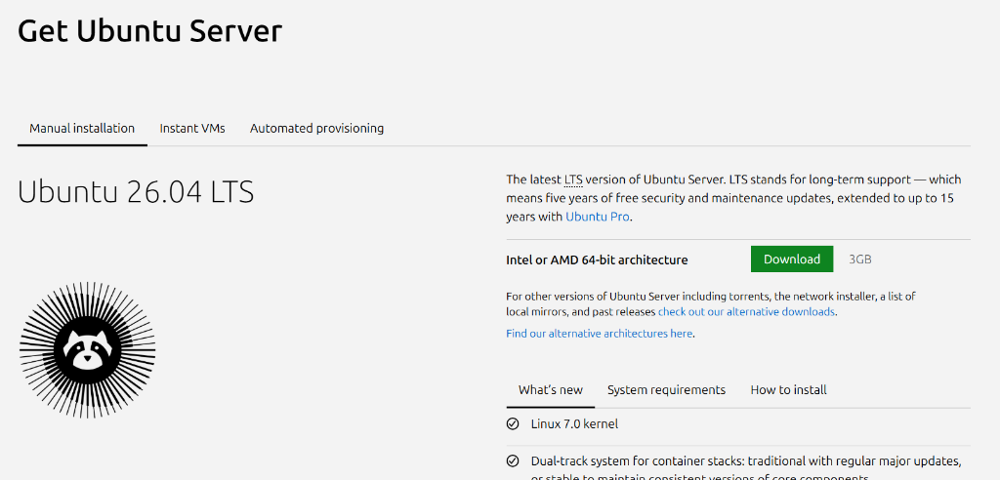
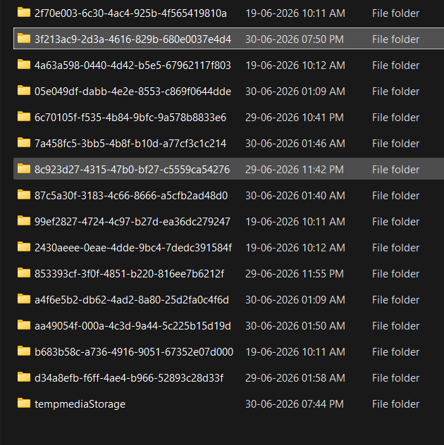

# Build a Mini Security Operations Center (SOC) Lab
[](https://opensource.org/licenses/MIT)
[](#)
[](#)
[](#)

A comprehensive, industry-standard cybersecurity laboratory demonstrating defensive engineering, SIEM deployment, log ingestion pipelines, threat simulation, and incident investigation.

---

## 📸 Dashboard Preview & Discover Logs
```carousel

<!-- slide -->

```

---

## 📖 Project Overview
This laboratory implements a centralized log collection and threat detection architecture modeled after enterprise Security Operations Center (SOC) structures. It integrates log shipping agents, custom alerting rule files, and active threat testing.

### Key Learning Outcomes & Accomplishments
*   **Centralized SIEM Pipeline:** Configured Elasticsearch and Kibana backends to aggregate system telemetry.
*   **Host JVM Performance Tuning:** Restrained Elasticsearch to 1GB JVM heap limits, resolving OOM crashes on memory-limited hosts.
*   **Secure Standalone Agent Deployment:** Setup standalone Elastic Agent log collection capturing auth and syslog messages.
*   **Active Attack Simulation:** Executed brute-force SSH attacks from Kali Linux using THC-Hydra.
*   **Incident Investigation & Hardening:** Queried authentication logs via KQL to identify Indicators of Compromise (IoCs).

---

## 🗺️ Architecture Design
```mermaid
graph LR
    subgraph Host OS (Windows)
        Browser[Edge/Chrome Client<br>http://localhost:5601]
    end

    subgraph NAT Network (10.0.2.0/24)
        Kali[Attacker Node: Kali Linux<br>IP: 10.0.2.15]
        SIEM[Target / SIEM Server: Ubuntu<br>IP: 10.0.2.4]
    end

    Kali -- "THC-Hydra Brute-Force" --> SIEM
    SIEM -- "Standalone Agent" --> ES[Elasticsearch]
    ES --> Kibana[Kibana Dashboard]
    Browser --> Kibana
```

---

## 📂 Project Structure
```text
Mini-SOC-Lab/
├── configurations/
│   └── siem_setup.md              # Installation & configuration guide
├── log_sources/
│   └── system_logs.txt            # Details on processed auth & syslog logs
├── detection_rules/
│   ├── brute_force_detection.txt  # Description & analyst response workflow
│   └── ssh_brute_force_rule.json  # Exportable Elastic SIEM detection rule
├── dashboards/
│   └── siem_dashboard_view.json   # Exportable Kibana dashboard configuration
├── scripts/
│   ├── simulate_ssh_logs.py       # Python mock log generator tool
│   └── verify_es_ingestion.py     # Python Elasticsearch health verification tool
├── screenshots/
│   ├── kibana_dashboard.png       # Ingestion dashboard view
│   └── kibana_discover_logs.png   # Log investigation discovery view
├── reports/
│   └── soc_lab_report.md          # Comprehensive corporate laboratory report
└── README.md                      # Executive introduction & usage guide
```

---

## 🚀 Installation & Quick Start

### 1. Build SIEM and JVM Tweaks
Follow instructions in [siem_setup.md](configurations/siem_setup.md) to set up Elasticsearch and Kibana on your Ubuntu Server. Ensure you add the JVM memory limit:
```bash
echo "-Xms1g" | sudo tee /etc/elasticsearch/jvm.options.d/memory.options
echo "-Xmx1g" | sudo tee -a /etc/elasticsearch/jvm.options.d/memory.options
sudo systemctl restart elasticsearch
```

### 2. Run the Verification Tools
You can verify Elasticsearch indexing health using the provided Python utility in the `/scripts` directory:
```bash
python scripts/verify_es_ingestion.py
```

### 3. Generate Simulated Logs
To populate log indexes or simulate brute force authentication entries without VM redirection:
```bash
sudo python scripts/simulate_ssh_logs.py /var/log/auth.log
```

---

## 🔍 Security Findings & Mitigations
*   **Identified Threat:** Automated credential spraying targeting administrative user accounts.
*   **Business Impact:** Risk of system compromise, privilege escalation, and credential disclosure.
*   **Recommended Hardening:**
    1.  Disable password auth in SSH (`PasswordAuthentication no`).
    2.  Configure public-key cryptography.
    3.  Deploy Fail2ban daemon for automatic IP blocking.\n