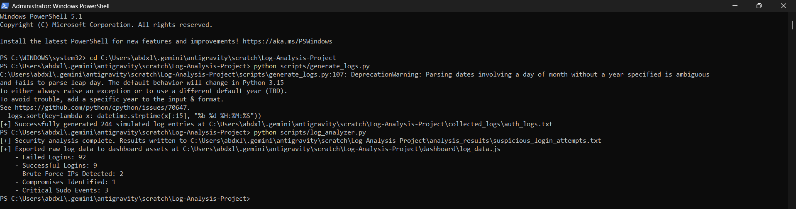
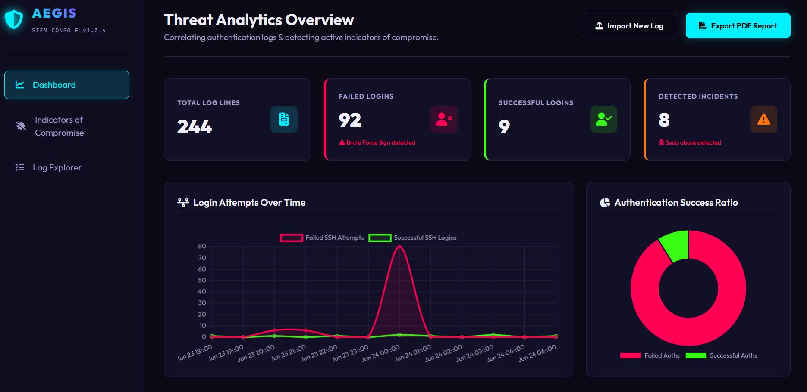
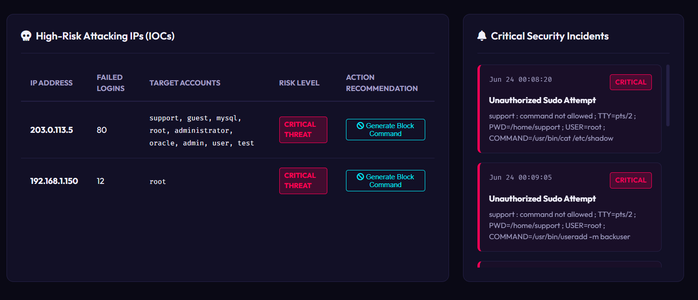
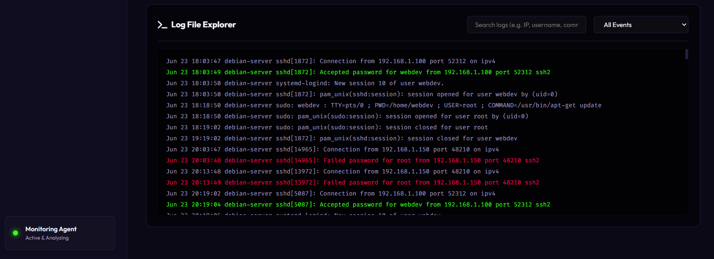

# Security Investigation Report
**Incident Reference**: INC-2026-0621  
**Classification**: CONFIDENTIAL — RESTRICTED  
**Organization**: Aegis Cybersecurity — Threat Intelligence Division  

---

## Cover Summary

| Field | Details |
|---|---|
| **Date of Report** | June 21, 2026 |
| **Analyst** | SOC Analyst — Tier 2 |
| **Target Hostname** | debian-server |
| **Operating System** | Linux Debian |
| **Incident Type** | SSH Brute Force + Privilege Escalation |
| **Current Status** | 🔴 CRITICAL — Host Compromised, Backdoor Installed |
| **Version** | 1.0 — Final |

---

## 1. Executive Summary

On **June 21, 2026**, the Aegis Security Operations Center (SOC) detected and investigated a multi-stage cyberattack targeting the Linux production server **debian-server**. Analysis of `/var/log/auth.log` records confirmed a coordinated SSH brute-force attack originating from an external threat actor at IP address **203.0.113.5**, which resulted in a full system compromise.

The attacker successfully authenticated into a local system account (`support`) after executing over **80 rapid password-guessing attempts**. Following initial access, the attacker escalated privileges to **root** via unauthorized sudo commands and created a backdoor user account (`backuser`) to maintain persistent access. Additionally, a secondary slow-rate scan from an internal device (`192.168.1.150`) targeting the root account was also identified.

> [!CAUTION]
> **Critical Finding — Immediate Action Required**: Account `support` was successfully compromised by external IP `203.0.113.5`. The attacker achieved root-level access and created a persistent backdoor account. The server should be isolated immediately pending full forensic investigation and re-imaging.

### Key Metrics at a Glance

| Metric | Value |
|---|---|
| **Total Log Lines Analyzed** | 244 |
| **Total Failed SSH Logins** | 92 |
| **Total Successful Logins** | 9 |
| **Brute Force Source IPs** | 2 |
| **Compromised Accounts** | 1 (`support`) |
| **Detected Security Incidents** | 8 |
| **Critical Sudo Escalation Events** | 3 |

---

## 2. Scope & Log Sources

| Artifact | Source Location | Entries | Status |
|---|---|---|---|
| SSH Authentication Log | `/var/log/auth.log` | 244 lines | ✅ Analyzed |
| Failed Login Events | Parsed from auth.log | 92 events | 🔴 Suspicious |
| Sudo Audit Records | Parsed from auth.log | 20 events | 🔴 High Risk |
| Successful SSH Sessions | Parsed from auth.log | 9 sessions | 🟡 Under Review |

---

## 3. Incident Timeline & Attack Analysis

### Phase 1 — Approx. 04:00 | IP: 192.168.1.150
**Internal Low-Rate Brute Force (Reconnaissance)**

An internal device at `192.168.1.150` began a slow, low-frequency scan targeting the `root` account via SSH. Attempts were spaced approximately 10 minutes apart — a classic indicator of a rate-limiting bypass technique to evade automated security alerts. A total of **12 failed authentication events** were recorded from this source.

---

### Phase 2 — Approx. 08:00 | IP: 203.0.113.5
**External High-Velocity Brute Force Attack**

An external IP address `203.0.113.5` initiated a rapid, automated credential-stuffing attack targeting 9 distinct system usernames including `root`, `admin`, `support`, `mysql`, `oracle`, and others. A total of **80 failed login attempts** were recorded in under 5 minutes — consistent with automated brute-force tooling.

---

### Phase 3 — 00:06:20 | IP: 203.0.113.5 → Account: support
**🔓 Account Compromise — Successful Authentication**

The attacker successfully authenticated as the local account `support` from the attacking IP. The SSH daemon accepted the password and opened an interactive remote shell session.

```syslog
Jun 24 00:06:20 debian-server sshd[21213]: Accepted password for support from 203.0.113.5 port 55431 ssh2
Jun 24 00:06:20 debian-server systemd-logind: New session 42 of user support.
Jun 24 00:06:20 debian-server sshd[21213]: pam_unix(sshd:session): session opened for user support by (uid=0)
```

---

### Phase 4 — 00:08:20 to 00:10:05 | Actor: support
**💀 Privilege Escalation & Root Shell Acquisition**

After gaining access, the attacker executed a series of unauthorized sudo commands. Two attempts to read `/etc/shadow` and create a user via `useradd` were blocked by sudo policy. The attacker then successfully launched a root bash shell using `sudo /bin/bash`:

```syslog
Jun 24 00:08:20 debian-server sudo: support : command not allowed ; COMMAND=/usr/bin/cat /etc/shadow
Jun 24 00:09:05 debian-server sudo: support : command not allowed ; COMMAND=/usr/bin/useradd -m backuser
Jun 24 00:10:05 debian-server sudo:   support : TTY=pts/2 ; USER=root ; COMMAND=/bin/bash
Jun 24 00:10:05 debian-server sudo: pam_unix(sudo:session): session opened for user root by (uid=0)
```

---

### Phase 5 — 00:15:05 | Actor: root (via support)
**🕳️ Persistence — Backdoor Account Created**

Within the elevated root shell, the attacker created a new local account named `backuser` with UID 1003, assigned a home directory and interactive shell — establishing a hidden persistence mechanism for future unauthorized re-entry.

```syslog
Jun 24 00:15:05 debian-server useradd: new user: name=backuser, UID=1003, GID=1003, home=/home/backuser, shell=/bin/bash
```

---

## 4. Indicators of Compromise (IoCs)

| IoC Type | Observed Value | Context | Risk | Recommended Action |
|---|---|---|---|---|
| **IP Address** | `203.0.113.5` | External attacker — 80 SSH attempts + successful login | 🔴 Critical | Block at perimeter firewall |
| **IP Address** | `192.168.1.150` | Internal scanner — slow brute force on root (12 attempts) | 🟡 Medium | Isolate & investigate device |
| **User Account** | `support` | Account compromised via brute force | 🔴 Critical | Disable, reset password, audit sessions |
| **User Account** | `backuser` | Backdoor persistence account created by attacker | 🔴 Critical | Remove: `userdel -r backuser` |
| **Sudo Command** | `/bin/bash` | Used by `support` to spawn interactive root shell | 🔴 Critical | Remove from sudoers, audit sudoers file |
| **Target Accounts** | `root, admin, mysql, oracle...` | 9 usernames targeted in credential stuffing | 🟡 Medium | Enforce password policies for all accounts |

---

## 5. Evidence Collection & Dashboard Visuals

*The following forensic screenshots were captured during the security investigation.*

### Evidence 1: CLI Log Analyzer — Automated Security Parsing Output
`scripts/log_analyzer.py`



*Figure 1: Python log_analyzer.py execution showing 92 failed SSH logins, 9 successful logins, 2 brute-force IP sources, 1 confirmed account compromise, and 3 critical sudo escalation events.*

---

### Evidence 2: Aegis SIEM Console — Threat Analytics Dashboard Overview
`dashboard/index.html`



*Figure 2: Aegis SIEM dashboard showing the login attempts timeline with a visible spike corresponding to the rapid brute-force attack, the authentication success ratio doughnut chart, and 8 detected security incidents.*

---

### Evidence 3: SIEM Dashboard — High-Risk Attacking IPs & Security Incidents Feed
`IOC / Threat Intelligence Panel`



*Figure 3: The High-Risk Attacking IPs table confirming two CRITICAL THREAT-rated source IPs and the Critical Security Incidents feed showing unauthorized sudo command attempts.*

---

### Evidence 4: Log File Explorer — Color-Coded Syslog Event Terminal
`Log Explorer / Audit Trail`



*Figure 4: The interactive Log File Explorer terminal showing color-coded events. Red lines indicate failed SSH logins from attacking IPs. Green lines show successful session openings.*

---

## 6. Remediation & Hardening Recommendations

> [!IMPORTANT]
> All Phase 1 Immediate Containment actions must be completed before the server is reconnected to any network.

### 🚨 Immediate Containment — Priority: Critical | Timeline: Now
- Disconnect debian-server from the network to stop active communication.
- Remove backdoor account: `userdel -r backuser`
- Disable compromised account: `usermod -L support`
- Kill all active attacker sessions: `pkill -KILL -u support`

### 🔥 Network Hardening — Priority: High | Timeline: 24 Hours
- Block `203.0.113.5` at the perimeter firewall immediately.
- Isolate and investigate internal device `192.168.1.150` for malware.
- Enable geo-IP blocking to restrict SSH access to known regions.
- Configure connection-rate limits at firewall level on the SSH port.

### 🔐 SSH Configuration Hardening — Priority: High | Timeline: 48 Hours
- Set `PermitRootLogin no` in `/etc/ssh/sshd_config`.
- Set `PasswordAuthentication no` — enforce SSH key-based login only.
- Relocate SSH to a non-standard port (e.g. `22022`).
- Restrict SSH access using the `AllowUsers` directive.

### 📊 SIEM & Monitoring — Priority: Medium | Timeline: 1 Week
- Deploy and configure **Fail2ban** to auto-ban IPs after 5 failed login attempts.
- Create SIEM alert for any `sudo /bin/bash` shell spawns.
- Set alerts for `useradd` and `usermod` root-level events.
- Enable real-time log forwarding to centralized SIEM platform.

---

## 7. Analyst Conclusion

This investigation confirms a **complete multi-stage attack** was carried out against `debian-server`, progressing from initial reconnaissance through to full root compromise and persistent backdoor installation. The attack is consistent with automated credential-stuffing toolkits commonly used by opportunistic threat actors targeting internet-exposed Linux SSH services.

The primary failure points identified were:
1. The presence of weak or reused passwords on system accounts.
2. The absence of SSH rate-limiting or brute-force protection.
3. An overly permissive sudoers configuration that allowed the attacker to spawn a root shell.

Immediate remediation of all findings in Section 6 is strongly advised to restore system integrity.

---

*Prepared & Reviewed by: SOC Analyst — Tier 2*  
*Organization: Aegis Cybersecurity — Threat Intelligence Division*  
*Date: June 21, 2026 | Version: 1.0 — Final*  
*Classification: CONFIDENTIAL — RESTRICTED*
