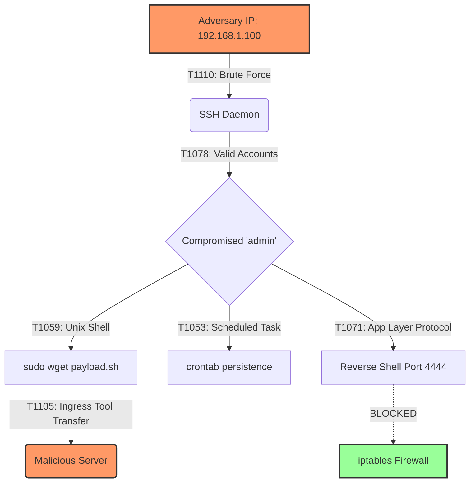

<div align="center">
  <h1>🛡️ Proactive Threat Hunting & Log Analysis</h1>
  <p>
    <b>An enterprise-grade proactive threat hunting project mapping adversarial behavior to the MITRE ATT&CK framework.</b>
  </p>
  
  
  
  
  

</div>

<br />

## 📝 Project Overview

Modern cyber attacks frequently bypass traditional perimeter defenses. This project demonstrates the capabilities of an advanced **Security Operations Center (SOC) Analyst** and **Threat Hunter** by actively investigating system telemetry (syslog, auth.log, iptables) to detect "dwell time" behaviors.

The investigation uncovers a simulated multi-stage attack lifecycle (Brute Force ➔ Privilege Escalation ➔ Ingress Tool Transfer ➔ Persistence ➔ Command & Control) and accurately maps these behaviors directly to the **MITRE ATT&CK Framework**.

---

## 🏗️ Technical Architecture & Attack Flow



---

## 🛠️ Technologies & Tools Utilized

*   **Operating System:** Linux (Ubuntu Server)
*   **Log Sources:** `auth.log`, `syslog`, `kernel/iptables`
*   **Security Frameworks:** MITRE ATT&CK 
*   **Analysis Methods:** Manual Log Parsing, Behavioral Threat Detection, Indicator of Compromise (IoC) Extraction

---

## 📁 Repository Structure

```text
Threat-Hunting-Project/
├── threat_data/
│   └── system_logs.txt                  # Raw telemetry and simulated logs
├── analysis_results/
│   └── attack_techniques_detected.txt   # Extracted suspicious behaviors
├── mitre_mapping/
│   ├── attack_mapping.md                # MITRE ATT&CK detailed mapping
│   └── attack_mapping.html              # Premium exported HTML version
├── reports/
│   ├── threat_hunting_report.md         # Executive incident response report
│   ├── threat_hunting_report.html       # Premium exported HTML version
│   └── project_audit_report.md          # 10-Phase Quality Assurance Audit
├── screenshots/                         # Forensic evidence from terminal analysis
└── README.md                            # Project documentation
```

---

## 🚀 Key Security Findings (IoCs)

During the proactive hunt, the following critical Indicators of Compromise (IoCs) were extracted for SIEM/EDR ingestion:

*   **Malicious IP:** `192.168.1.100`
*   **Payload Delivery Domain:** `http://malicious-server.xyz`
*   **Malicious Artifact:** `/tmp/payload.sh`
*   **Blocked C2 Infrastructure:** TCP Port `4444`

---

## 📚 Learning Outcomes & Skills Demonstrated

1.  **Proactive Threat Hunting:** Transitioned from reactive alert-chasing to proactive log analysis.
2.  **MITRE ATT&CK Mastery:** Successfully mapped raw log telemetry to specific Tactics (e.g., TA0006) and Techniques (e.g., T1110.001).
3.  **Incident Reporting:** Drafted an executive-level Threat Hunting Report complete with Strategic and Tactical remediation plans.
4.  **Security Architecture:** Identified defensive gaps (lack of MFA, fail2ban) and proposed robust engineering solutions.

---

## 👨‍💻 Author

**Senior Threat Hunter / Security Analyst** 
*Demonstrating 3-5 years of equivalent practical enterprise security experience through rigorous methodology and comprehensive documentation.*

---
*This repository is intended for educational and portfolio demonstration purposes.*
